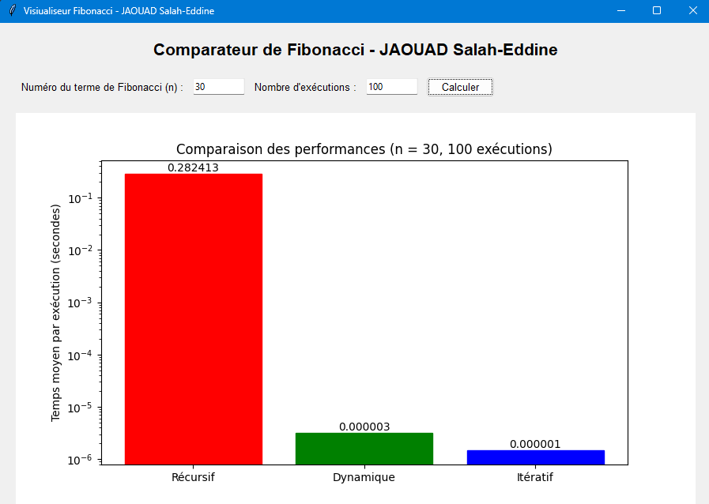
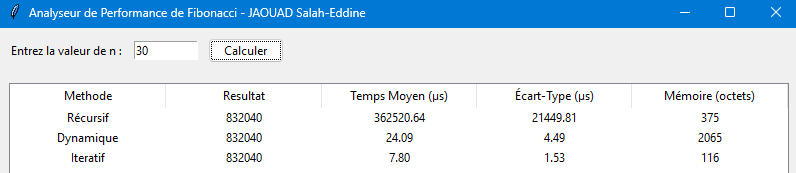

# Application : Comparaison des implémentations de la suite de Fibonacci

Ce dépôt contient trois implémentations différentes de la suite de Fibonacci en Python :

1. **Version récursive** : Implémentation simple mais inefficace pour de grandes valeurs de `n`.
2. **Version récursive avec programmation dynamique** : Amélioration de la version récursive grâce à la mémorisation.
3. **Version itérative** : Version optimisée en termes de performance et d'utilisation mémoire.

## Objectifs

- Implémenter les trois versions de la suite de Fibonacci.
- Calculer et comparer les temps d'exécution de chaque version.
- Visualiser et afficher les résultats sous forme de tableau et de graphiques.

## Fichiers inclus

### 1. `visualisateur.py`

Une application graphique créée avec `Tkinter` qui permet de comparer les performances des trois implémentations. Elle inclut :

- **Entrées utilisateur** :
  - Le numéro du terme de Fibonacci (`n`).
  - Le nombre d'exécutions pour les tests de performance.
- **Sorties** :
  - Un graphique comparant les temps moyens d'exécution.
  - Un tableau affichant les résultats des trois méthodes (résultats et temps moyens).
- **Dépendances** :
  - `Tkinter` pour l'interface utilisateur.
  - `matplotlib` pour les graphiques.
  - `timeit` pour des mesures précises des temps d'exécution.

### 2. `tableau.py`

Un programme similaire à `visualisateur.py` qui se concentre principalement sur la création et l'affichage des résultats sous forme de tableau.

## Installation

### Prérequis

- Python 3.7 ou supérieur
- Modules Python nécessaires :
  - `matplotlib`
  - `tkinter`

### Étapes

1. Clonez le dépôt :

   ```bash
   git clone https://github.com/jaouad4/algorithmes-suite-fibonacci.git
   ```

2. Installez les dépendances (si elles ne sont pas déjà installées) :

   ```bash
   pip install matplotlib
   ```

3. Exécutez le programme principal :

   ```bash
   python visualisateur.py
   ```
   ```bash
   python tableau.py
   ```

## Utilisation

1. Lancez `visualisateur.py`.
2. Entrez la valeur de `n` et le nombre d'exécutions souhaité.
3. Cliquez sur le bouton **Calculer**.
4. Visualisez les résultats dans le graphique et le tableau générés.

-Même démarche pour `tableau.py`.

## Notes importantes

- La version récursive devient très inefficace pour des valeurs de `n` supérieures à 30 en raison de sa complexité exponentielle.
- Les temps d'exécution sont calculés en prenant la moyenne de plusieurs exécutions pour plus de précision.

## Auteur

**JAOUAD Salah-Eddine**

Cette application a été réalisé dans le but de comparer différentes approches algorithmiques et d'évaluer leurs performances.

---

### Capture d'écran

`visiualisateur.py`


`tableau.py`


### Contributions

Les contributions sont les bienvenues. Veuillez ouvrir une issue ou un pull request pour toute suggestion ou amélioration.
